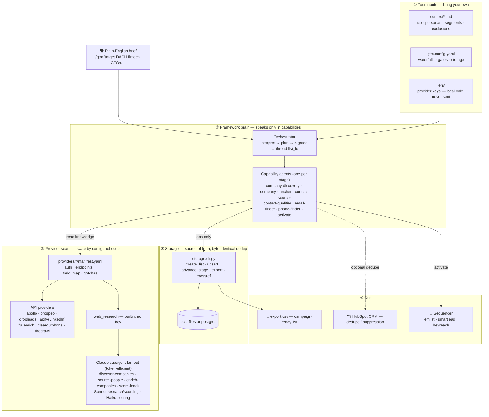

# gtm-pipeline

> A provider-agnostic, **bring-your-own-keys** GTM contact pipeline you drive from
> plain English inside Claude Code.

Give it your API keys (`.env`), your ICP as markdown (`context/`), and one wiring
file (`gtm.config.yaml`). Then tell it a campaign concept —
*"target mid-market fintech CFOs in DACH for our compliance product"* — and it runs:

```
company_search → company_enrich → people_search → qualify → email_enrich → phone_enrich → activate
   (discover)      (account intel)   (source)      (score)     (find email)   (find phone)   (push to sequencer)
```

…producing a campaign-ready, deduplicated contact list pushed into the sequencer
of your choice.

## Architecture

One brief flows down five layers — inputs → brain → provider seam → storage → out. Agents
speak only in capabilities and read provider manifests, so you swap providers by editing
config, never code. Full write-up + ASCII fallback in [docs/architecture.md](docs/architecture.md).



See it run end-to-end on a synthetic campaign in
[examples/dach-fintech-cfos/](examples/dach-fintech-cfos/).

## Why it's different

- **Swap providers by editing config, not prompts.** Every provider is a declarative
  `manifest.yaml` (auth, endpoints, field mappings, gotchas). Reorder a waterfall or
  drop in a new enricher without touching an agent.
- **Bring your own everything.** Your ICP, personas, and segments live in
  `context/*.md`. Nothing about any one company is baked into the framework.
- **Graceful with partial keys.** Have only an Apollo key? You get a working, thinner
  pipeline — unkeyed providers are skipped with a log line, no edits required.
- **Two storage backends, identical semantics.** `local` (zero-setup files) or
  `postgres` (shared DB, cross-campaign dedup). Same stage handoffs either way.
- **Secrets never leave your machine except to each provider's own API.** See
  [SECURITY.md](SECURITY.md).

## Quickstart

```bash
# 1. Configure
cp .env.example .env                       # fill in the keys you have
cp gtm.config.example.yaml gtm.config.yaml # tweak waterfalls / storage / autonomy
cp context/icp.md.example      context/icp.md        # describe what you sell & who you target
cp context/personas.md.example context/personas.md   # persona → title keywords

# 2. Load secrets into your shell
set -a && source .env && set +a

# 3. See what your keys + config will actually do
python3 scripts/show-plan.py

# 4. Drive it from Claude Code
#    /gtm target mid-market fintech CFOs in DACH for our compliance product
```

The default config uses the `local` backend, so a first run needs no database. Full
walkthrough in [docs/quickstart.md](docs/quickstart.md).

## Layout

| Path | What |
|---|---|
| `agents/` | The pipeline brain — one capability-agnostic agent per stage + an orchestrator |
| `providers/` | Pluggable provider registry (declarative `manifest.yaml` + optional `adapter.py`) |
| `storage/` | `cli.py` (uniform op set) + self-contained Postgres schema |
| `context/` | Your ICP / personas / segments / exclusions (shipped as `.example` skeletons) |
| `config/` | `region-expansion.yaml` and other externalized tables |
| `docs/` | Quickstart, capability taxonomy, how to write a provider |

## Providers

Swap any of these by editing `gtm.config.yaml` — never the agents
([how](docs/swapping-providers.md)). A provider is used only if its key is set.

| Provider | Capabilities | Kind |
|---|---|---|
| `web_research` | company_search, linkedin_url_lookup, company_enrich | builtin (no key) |
| `firecrawl` | company_enrich | script |
| `apify` | people_search | script |
| `apollo` | people_search, company_search, email_enrich, phone_enrich | spec |
| `dropleads` | people_search | spec |
| `fullenrich` | email_enrich, phone_enrich | script |
| `clearoutphone` | phone_validate | spec |
| `prospeo` | company_search, people_search, email_enrich, phone_enrich, company_enrich | spec — **single-provider stack** |
| `lemlist` | sequencer_push (email) | script |
| `smartlead` | sequencer_push (email) | spec |
| `heyreach` | sequencer_push (LinkedIn) | spec |
| `hubspot` | crm_dedupe (suppress CRM dupes) | script, read-only |

Run `python3 scripts/show-plan.py` to see which ones your current keys + config resolve to.
You can run the **whole pipeline on one key** (Apollo or Prospeo) — see
[docs/single-provider.md](docs/single-provider.md).

## Docs

- [examples/dach-fintech-cfos/](examples/dach-fintech-cfos/) — a complete worked run (ICP, config, provider plan, export CSV, activation log)
- [docs/architecture.md](docs/architecture.md) — the layered diagram (brief → … → sequencer/CRM)
- [docs/quickstart.md](docs/quickstart.md) — setup, the four gates, storage backends
- [docs/single-provider.md](docs/single-provider.md) — run on one key (Apollo / Prospeo); why the free-search providers
- [docs/capabilities.md](docs/capabilities.md) — capability taxonomy + canonical records + storage ops
- [docs/swapping-providers.md](docs/swapping-providers.md) — config-only provider swaps
- [docs/writing-a-provider.md](docs/writing-a-provider.md) — add a manifest / adapter
- [SECURITY.md](SECURITY.md) — BYOK, keys never transmitted

## Verify (no keys needed)

```bash
bash scripts/selftest.sh      # storage round-trip, adapter estimates, plan resolution
bash scripts/scrub-check.sh   # secret/leak gate — run before publishing a fork
```

## License

[Apache-2.0](LICENSE).
