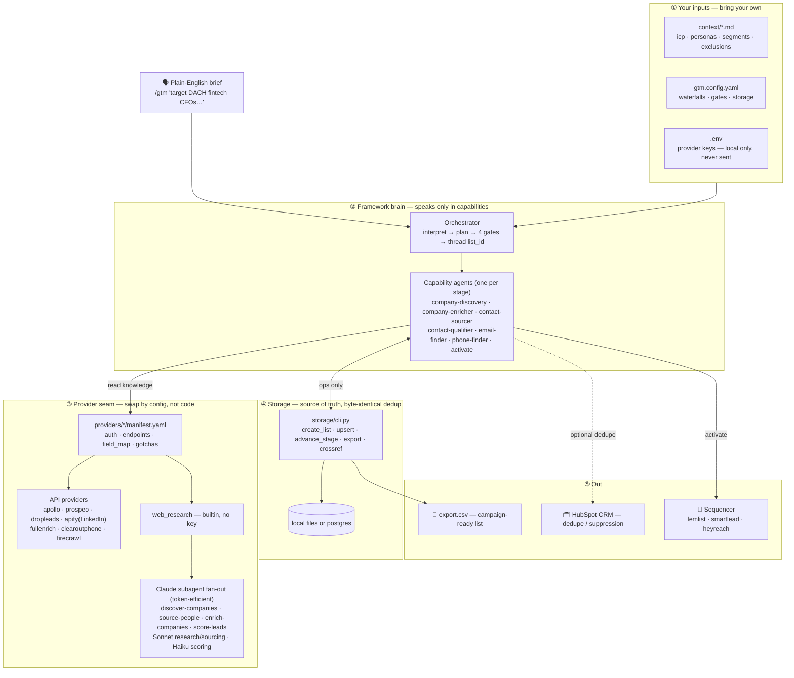

# gtm-pipeline

> **An agent-native GTM pipeline runtime** for portable list building, enrichment,
> qualification, and activation.

Give it your ICP and personas (markdown), your provider keys (a local `.env`), and one
wiring file (`gtm.config.yaml`). Then describe the campaign in plain English inside Claude
Code:

```
/gtm target mid-market fintech CFOs in DACH for our compliance product
```

It turns that brief into a deduped, qualified, enriched, **sequencer-ready** contact list —
without locking your workflow into one data-provider UI. Under the hood it runs seven
explicit stages, each threading a single `list_id`:

```
company_search → company_enrich → people_search → qualify → email_enrich → phone_enrich → activate
   (discover)      (account intel)   (source)      (score)     (find email)   (find phone)   (push to sequencer)
```

It is **not** trying to clone Clay. It is trying to make the underlying GTM workflow
**portable, auditable, and agent-executable**:

- ICP and personas live in markdown.
- Provider waterfalls live in config.
- API quirks live in provider manifests.
- Agents speak only in capabilities.
- Storage keeps every stage tied to one `list_id`.
- Human gates protect spend and sending.

---

## Why this exists

Most GTM list-building workflows share the same problems:

- The **targeting logic** lives in one operator's head.
- The **enrichment logic** lives inside one vendor's UI.
- **Provider swaps** mean rebuilding the whole workflow.
- **Agents** can research, but they lose state, duplicate work, and flood context.
- **Sending tools** receive a list — but not the reasoning behind why those leads were chosen.

`gtm-pipeline` turns that into a portable **execution layer**:

- ICP and personas live as markdown context.
- Providers are declared as swappable capabilities.
- Every stage writes to a shared source of truth (one `list_id`).
- Subagents do the expensive research/scoring in parallel, without flooding the main context.
- Human gates protect spend and activation.

## Before / after

**Before** — a GTM operator manually: builds a company list in one tool → exports/imports
to another → searches for people → applies persona judgment by hand → runs enrichment
waterfalls → checks the CRM → cleans a CSV → pushes to a sequencer. It works, but it's hard
to repeat, hard to audit, and hard to hand off.

**After** — you write:

```
/gtm target mid-market fintech CFOs in DACH for our compliance product
```

…and the pipeline reads your ICP/persona context → resolves providers from your keys →
builds a company list → suppresses CRM matches → enriches account intel → sources contacts
→ scores them against your rubric → enriches verified emails/phones → exports or activates
into your sequencer. Same expertise — encoded once, requested in plain English.

## See it run

A complete, end-to-end run lives in **[examples/dach-fintech-cfos/](examples/dach-fintech-cfos/)**:
the brief, the filled-in ICP, the real provider plan, the cited account intel, the
campaign-ready [export.csv](examples/dach-fintech-cfos/output/export.csv), and the
[activation log](examples/dach-fintech-cfos/activation-log.md). It shows
`/gtm target mid-market fintech CFOs in DACH…` becoming a deduped, scored list with the
SKIPs removed and the qualified CFOs pushed to lemlist. The outputs were generated through
the real `storage/cli.py` + `show-plan.py`, so they match a live run (the data itself is
synthetic). **The example proves the abstraction** — read it before the manifests and
storage details below.

## What this unlocks

**1. List building becomes portable.** Your ICP, personas, scoring rules, provider
waterfalls, and activation logic aren't trapped in one enrichment tool — or one person's
head.

**2. Provider choice becomes configuration.** Swap Apollo for Prospeo, FullEnrich,
Dropleads, Smartlead, Lemlist, or HeyReach by editing `gtm.config.yaml` — never rewriting a
prompt or agent. Only keyed providers run, so a partial key set still gives a working,
thinner pipeline (unkeyed providers skip with a one-line log, no edits).

**3. Agents stop being stateless researchers.** Every stage writes to storage through the
same canonical records, so discovery, sourcing, qualification, enrichment, and activation
share one `list_id` — no more "the agent researched it but lost it."

**4. GTM judgment becomes explicit.** Qualification isn't hidden in someone's head.
Personas, segments, exclusions, and the 0–10 scoring rubric live in `context/*.md` —
versioned and reviewable.

**5. Expensive work gets routed intelligently.** Research and sourcing run through Sonnet
subagents; high-volume scoring runs through Haiku. The orchestrator keeps the pipeline
moving without stuffing every intermediate result into context (see below).

**6. Spend and sends stay gated.** The system can move fast, but paid enrichment and live
activation sit behind configurable gates (plan → qualify review → pre-paid-enrichment →
activation).

Storage is `local` (zero-setup files) or `postgres` (shared DB, cross-campaign dedup) with
identical stage semantics, and secrets are read from your local `.env` only — sent to each
provider's own API and nowhere else ([SECURITY.md](SECURITY.md)).

## Why subagents matter here

A naive agentic GTM workflow asks one large model to research companies, source people,
score leads, enrich records, **and** remember every intermediate result. That doesn't
scale — it loses state and floods context.

`gtm-pipeline` uses **subagent fan-out** for the stages that benefit from parallel work,
driven by bundled workflows:

- **`discover-companies`** — one `company-researcher` (Sonnet) per search angle, merged + deduped by domain.
- **`source-people`** — one `people-sourcer` (Sonnet) per company.
- **`enrich-companies`** — a parallel research pass per account (basics / funding / tech / leadership / "why now" signals), then synthesize + source-verify.
- **`score-leads`** — batched **Haiku** scoring against your ICP rubric.

The workflow script owns the loop, the merge, and the dedupe; **the main agent only
receives the final structured result.** That's how you get breadth (many companies and
contacts at once) without flooding context or paying top-tier prices for cheap work.

## The operator abstraction

The point isn't only speed — it's that **the skill of building a good GTM list can be
encoded.** A senior operator defines the system once: what good accounts look like, which
personas matter, which titles to include or exclude, which providers to trust per stage,
when to spend enrichment credits, when to suppress CRM matches, when to activate. Then
anyone on the team requests the outcome in plain English.

## Is this a Clay replacement?

Not exactly. **Clay** is a powerful GTM workbench — visual, flexible, and great for
human-operated enrichment workflows. `gtm-pipeline` is a different thing: a **portable
execution layer for agent-driven GTM workflows** — markdown for ICP/persona context, config
for provider waterfalls, manifests for provider-specific API detail, storage as the shared
source of truth, and agents/subagents executing from a plain-English brief. The goal isn't
to clone a UI; it's to make the underlying workflow portable, auditable, and executable by
agents.

## Architecture

One brief flows down five layers — inputs → brain → provider seam → storage → out. Agents
speak only in capabilities and read provider manifests, so you swap providers by editing
config, never code. Full write-up + ASCII fallback in [docs/architecture.md](docs/architecture.md).



## Quickstart

```bash
# 1. Configure
cp .env.example .env                       # fill in the keys you have
cp gtm.config.example.yaml gtm.config.yaml # tweak waterfalls / storage / autonomy
cp context/icp.md.example      context/icp.md        # describe what you sell & who you target
cp context/personas.md.example context/personas.md   # persona → title keywords

# 2. Load secrets into your shell
set -a && source .env && set +a

# 3. See what your keys + config will actually do
python3 scripts/show-plan.py

# 4. Drive it from Claude Code
#    /gtm target mid-market fintech CFOs in DACH for our compliance product
```

The default config uses the `local` backend, so a first run needs no database. You can run
the **whole pipeline on one key** (Apollo or Prospeo) — see
[docs/single-provider.md](docs/single-provider.md). Full walkthrough in
[docs/quickstart.md](docs/quickstart.md).

## Providers

Providers are interchangeable **capabilities** — company search, people search, email
enrich, phone enrich, CRM dedupe, sequencer push. Swap any of them by editing
`gtm.config.yaml`, never the agents ([how](docs/swapping-providers.md)). A provider is used
only if its key is set.

| Provider | Capabilities | Kind |
|---|---|---|
| `web_research` | company_search, linkedin_url_lookup, company_enrich, people_search | builtin (no key) |
| `firecrawl` | company_enrich | script |
| `apify` | people_search | script (LinkedIn) |
| `apollo` | people_search, company_search, email_enrich, phone_enrich | spec — single-provider stack |
| `dropleads` | people_search | spec |
| `fullenrich` | email_enrich, phone_enrich | script |
| `clearoutphone` | phone_validate | spec |
| `prospeo` | company_search, people_search, email_enrich, phone_enrich, company_enrich | spec — single-provider stack |
| `lemlist` | sequencer_push (email) | script |
| `smartlead` | sequencer_push (email) | spec |
| `heyreach` | sequencer_push (LinkedIn) | spec |
| `hubspot` | crm_dedupe (suppress CRM dupes) | script, read-only |

Run `python3 scripts/show-plan.py` to see which ones your current keys + config resolve to.

## Layout

| Path | What |
|---|---|
| `agents/` | The pipeline brain — one capability-agnostic agent per stage + an orchestrator |
| `.claude/` | Bundled subagent workflows + custom subagents (the parallel fan-out) |
| `providers/` | Pluggable provider registry (declarative `manifest.yaml` + optional `adapter.py`) |
| `storage/` | `cli.py` (uniform op set) + self-contained Postgres schema |
| `context/` | Your ICP / personas / segments / exclusions (shipped as `.example` skeletons) |
| `examples/` | A complete synthetic run, end to end |
| `docs/` | Architecture, capability taxonomy, single-provider, how to write a provider |

## Docs

- [examples/dach-fintech-cfos/](examples/dach-fintech-cfos/) — a complete worked run (ICP, config, provider plan, export CSV, activation log)
- [docs/architecture.md](docs/architecture.md) — the layered diagram (brief → … → sequencer/CRM)
- [docs/quickstart.md](docs/quickstart.md) — setup, the four gates, storage backends
- [docs/single-provider.md](docs/single-provider.md) — run on one key (Apollo / Prospeo); why the free-search providers
- [docs/capabilities.md](docs/capabilities.md) — capability taxonomy + canonical records + storage ops
- [docs/swapping-providers.md](docs/swapping-providers.md) — config-only provider swaps
- [docs/writing-a-provider.md](docs/writing-a-provider.md) — add a manifest / adapter
- [SECURITY.md](SECURITY.md) — BYOK, keys never transmitted

## Verify (no keys needed)

```bash
bash scripts/selftest.sh      # storage round-trip, adapter estimates, plan resolution
bash scripts/scrub-check.sh   # secret/leak gate — run before publishing a fork
```

## Status & scope

This is an open-source **reference implementation** — an agent-native GTM pipeline *pattern*
and portable execution layer, not a finished product. The architecture and a full
end-to-end example are here; the example data is explicitly synthetic, and live runs need
your own provider keys. Use it as a foundation to build on, not a drop-in "GTM OS."
Contributions welcome — see [CONTRIBUTING.md](CONTRIBUTING.md).

## License

[Apache-2.0](LICENSE).
