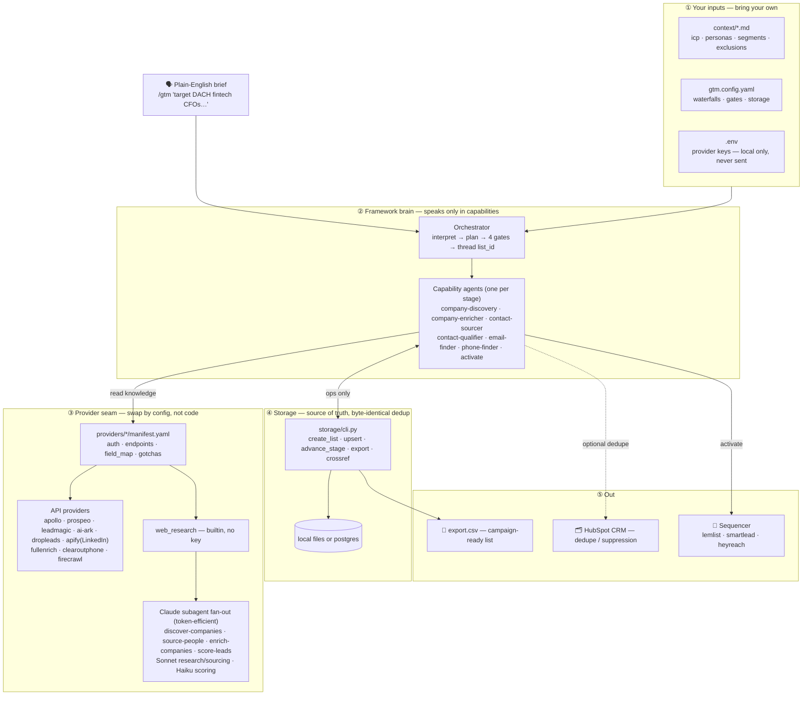

# gtm-pipeline

> **An agent-native GTM pipeline runtime** for portable list building, enrichment,
> qualification, and activation.

Give it your ICP and personas (markdown), your provider keys (a local `.env`), and one
wiring file (`gtm.config.yaml`). Then describe the campaign in plain English inside Claude
Code:

```
/gtm target mid-market fintech CFOs in DACH for our compliance product
```

It turns that brief into a deduped, qualified, enriched, **sequencer-ready** contact list.
Seven explicit stages, each threading one `list_id`:

```
company_search → company_enrich → people_search → qualify → email_enrich → phone_enrich → activate
   (discover)      (account intel)   (source)      (score)     (find email)   (find phone)   (push to sequencer)
```

It's not a Clay clone. It makes the GTM workflow itself **portable, auditable, and
agent-executable.**

---

## Why this exists

Most GTM list-building has the same failure modes:

- The **targeting logic** lives in one operator's head.
- The **enrichment logic** lives inside one vendor's UI.
- **Provider swaps** mean rebuilding the workflow.
- **Agents** research, but lose state, duplicate work, and flood context.
- **Sending tools** get a list — but not the reasoning behind it.

`gtm-pipeline` makes the workflow portable: your judgment lives in `context/*.md` and
`gtm.config.yaml`, providers become swappable capabilities, every stage writes to one shared
`list_id`, and human gates protect spend and sending.

## Before / after

**Before** — manually: build a list in one tool → export/import to another → search for
people → apply persona judgment by hand → run enrichment waterfalls → check the CRM → clean
a CSV → push to a sequencer. It works, but it's hard to repeat, audit, or hand off.

**After** — write `/gtm target mid-market fintech CFOs in DACH for our compliance product`,
and the pipeline reads your ICP context → resolves providers from your keys → discovers
companies → suppresses CRM matches → enriches account intel → sources contacts → scores them
against your rubric → finds verified emails/phones → exports or activates. Same expertise —
encoded once, requested in plain English.

## See it run

A complete run is in **[examples/dach-fintech-cfos/](examples/dach-fintech-cfos/)**: the
brief, the ICP, the real provider plan, cited account intel, the campaign-ready
[export.csv](examples/dach-fintech-cfos/output/export.csv), and the
[activation log](examples/dach-fintech-cfos/activation-log.md). It shows the **shape** of a
run — the data flow, the canonical records, the SKIPs removed before paid enrichment —
generated through the actual `storage/cli.py` + `show-plan.py`.

## What this unlocks

- **Provider choice is configuration.** Swap Apollo for Prospeo, LeadMagic, AI Ark, FullEnrich,
  Dropleads, Smartlead, Lemlist, or HeyReach in `gtm.config.yaml` — never a prompt or agent.
  Only keyed providers run, so a partial key set still gives a working, thinner pipeline.
- **State survives the pipeline.** Every stage writes canonical records under one `list_id`,
  so discovery → sourcing → qualify → enrichment → activation never "research it and lose it."
- **Judgment is explicit and reviewable.** Personas, segments, exclusions, and the 0–10
  rubric live in `context/*.md` — versioned, not in someone's head.
- **Expensive work is routed.** Research/sourcing on Sonnet subagents, high-volume scoring on
  Haiku, intermediate results kept out of the main context (below).
- **Spend and sends are gated.** Plan → qualify review → pre-paid-enrichment → activation,
  all configurable.

Storage is `local` (zero-setup) or `postgres` (shared, cross-campaign dedup) with identical
semantics; secrets are read from your local `.env` and sent only to each provider's own API.

## Why subagents matter here

A naive agentic workflow asks one model to research companies, source people, score leads,
enrich records, **and** hold every intermediate result. It loses state and floods context.

`gtm-pipeline` fans out subagents for the parallel stages via bundled workflows:

- **`discover-companies`** — one `company-researcher` (Sonnet) per search angle, deduped by domain.
- **`source-people`** — one `people-sourcer` (Sonnet) per company.
- **`enrich-companies`** — a parallel research pass per account, then synthesize + source-verify.
- **`score-leads`** — batched **Haiku** scoring against your rubric.

The workflow script owns the loop, merge, and dedupe; the main agent receives only the final
structured result — breadth without flooding context or paying top-tier prices for cheap work.

## The operator abstraction

The point isn't speed — it's that **the skill of building a good GTM list can be encoded**:
what good accounts look like, which personas matter, which titles to include or exclude,
which providers to trust per stage, when to spend, when to suppress, when to activate. A
senior operator defines it once; anyone then requests the outcome in plain English.

The runtime is open source on purpose. The durable value isn't the plumbing — it's the
judgment you encode into it and the per-campaign context it accumulates. Open-sourcing the
pattern is a deliberate bet that differentiation lives in that judgment layer, not the pipes.

## Is this a Clay replacement?

No. **Clay** is a visual GTM workbench for human-operated enrichment. `gtm-pipeline` is a
portable execution layer for *agent-driven* workflows — run from a plain-English brief, not
clicked together in a UI. Different tool, different job; it isn't trying to clone the
workbench.

## Architecture

One brief flows down five layers — inputs → brain → provider seam → storage → out. Agents
speak only in capabilities and read provider manifests, so you swap providers by editing
config, never code. Full write-up + ASCII fallback in [docs/architecture.md](docs/architecture.md).



## Quickstart

```bash
# 1. Configure
cp .env.example .env                       # fill in the keys you have
cp gtm.config.example.yaml gtm.config.yaml # tweak waterfalls / storage / autonomy
cp context/icp.md.example      context/icp.md        # describe what you sell & who you target
cp context/personas.md.example context/personas.md   # persona → title keywords

# 2. Load secrets into your shell
set -a && source .env && set +a

# 3. See what your keys + config will actually do
python3 scripts/show-plan.py

# 4. Drive it from Claude Code
#    /gtm target mid-market fintech CFOs in DACH for our compliance product
```

The default config uses the `local` backend, so a first run needs no database. You can run
the **whole pipeline on one key** (Apollo, Prospeo, LeadMagic, or AI Ark) — see
[docs/single-provider.md](docs/single-provider.md). Full walkthrough in
[docs/quickstart.md](docs/quickstart.md).

## Providers

Providers are interchangeable **capabilities** — company search, people search, email
enrich, phone enrich, CRM dedupe, sequencer push. Swap any of them by editing
`gtm.config.yaml`, never the agents ([how](docs/swapping-providers.md)). A provider is used
only if its key is set.

| Provider | Capabilities | Kind |
|---|---|---|
| `web_research` | company_search, linkedin_url_lookup, company_enrich, people_search | builtin (no key) |
| `firecrawl` | company_enrich | script |
| `apify` | people_search | script (LinkedIn) |
| `apollo` | people_search, company_search, email_enrich, phone_enrich | spec — single-provider stack |
| `dropleads` | people_search | spec |
| `fullenrich` | email_enrich, phone_enrich | script |
| `clearoutphone` | phone_validate | spec |
| `prospeo` | company_search, people_search, email_enrich, phone_enrich, company_enrich | spec — single-provider stack |
| `leadmagic` | company_search, company_enrich, people_search, email_enrich, email_validate, phone_enrich, linkedin_url_lookup | spec — single-provider stack + cheap validator |
| `ai-ark` | company_search, company_enrich, people_search, email_enrich, phone_enrich, linkedin_url_lookup | spec + script — discovery+intel in one call; async/trackId email |
| `lemlist` | sequencer_push (email) | script |
| `smartlead` | sequencer_push (email) | spec |
| `heyreach` | sequencer_push (LinkedIn) | spec |
| `hubspot` | crm_dedupe (suppress CRM dupes) | script, read-only |

Run `python3 scripts/show-plan.py` to see which ones your current keys + config resolve to.

## Layout

| Path | What |
|---|---|
| `agents/` | The pipeline brain — one capability-agnostic agent per stage + an orchestrator |
| `.claude/` | Bundled subagent workflows + custom subagents (the parallel fan-out) |
| `providers/` | Pluggable provider registry (declarative `manifest.yaml` + optional `adapter.py`) |
| `storage/` | `cli.py` (uniform op set) + self-contained Postgres schema |
| `context/` | Your ICP / personas / segments / exclusions (shipped as `.example` skeletons) |
| `examples/` | A complete synthetic run, end to end |
| `docs/` | Architecture, capability taxonomy, single-provider, how to write a provider |

## Docs

- [examples/dach-fintech-cfos/](examples/dach-fintech-cfos/) — a complete worked run (ICP, config, provider plan, export CSV, activation log)
- [docs/architecture.md](docs/architecture.md) — the layered diagram (brief → … → sequencer/CRM)
- [docs/quickstart.md](docs/quickstart.md) — setup, the four gates, storage backends
- [docs/single-provider.md](docs/single-provider.md) — run on one key (Apollo / Prospeo); why the free-search providers
- [docs/capabilities.md](docs/capabilities.md) — capability taxonomy + canonical records + storage ops
- [docs/swapping-providers.md](docs/swapping-providers.md) — config-only provider swaps
- [docs/writing-a-provider.md](docs/writing-a-provider.md) — add a manifest / adapter

## Compliance & acceptable use

You are responsible for using each provider within its terms — including automation/scraping
limits (e.g. LinkedIn data reached via `web_research` or `apify`) and applicable
data-protection law (GDPR, CCPA, and local rules) when you store or contact people. The
framework gives you the seams to choose compliant providers and to gate sending; it does not
grant permission to use any provider or dataset. Confirm your own legal basis before a live
run.

## Verify (no keys needed)

```bash
bash scripts/selftest.sh      # storage round-trip, adapter estimates, plan resolution
bash scripts/scrub-check.sh   # secret/leak gate — run before publishing a fork
```

## Security & status

Secrets are read from your local `.env` only and never fetched over the network — details in
[SECURITY.md](SECURITY.md).

This is an open-source **reference implementation** — a pattern and portable execution layer,
not a finished product. The architecture and a full example are here; the example data is
synthetic (so it shows the data flow, not live-API survival), and real runs need your own
keys. Build on it; don't treat it as a drop-in "GTM OS." Contributions welcome —
[CONTRIBUTING.md](CONTRIBUTING.md).

## License

[Apache-2.0](LICENSE).
