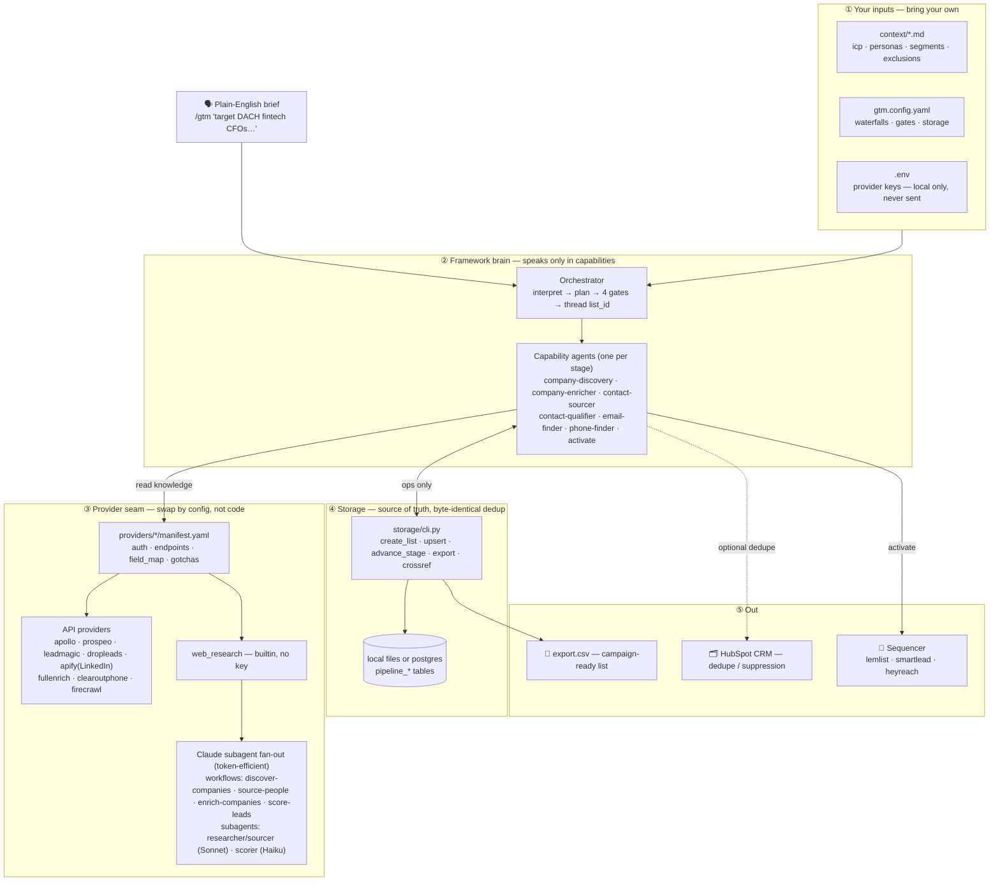

# Architecture

One plain-English brief flows down through five layers: your inputs → the framework brain
→ the provider seam → storage → out to your sequencer/CRM. Agents speak only in
**capabilities** and read **provider manifests**, so swapping a provider is a config edit,
never an agent edit. Secrets stay in your local `.env` and are sent only to each provider's
own API.



## The layers

1. **Your inputs (BYO).** `context/*.md` is *who* you target; `gtm.config.yaml` is *which*
   providers run in what order + the gates + storage backend; `.env` holds keys, read from
   the local environment only.
2. **Framework brain.** The orchestrator interprets the brief into a plan (Gate #1), then
   threads one `list_id` through the capability agents — one per stage. The agents contain
   zero provider names in their logic.
3. **Provider seam.** Each provider is a declarative `manifest.yaml` (+ a thin stdlib
   adapter when the call is gnarly). `web_research` is builtin (no key) and runs the Claude
   subagent fan-out workflows for discovery, sourcing, account intel, and scoring —
   intermediate results stay in the workflow script, so only the answer hits context.
4. **Storage.** Agents call `storage/cli.py` ops (never raw SQL/file IO). Dedup on
   normalized LinkedIn URL / domain is byte-identical across `local` and `postgres`.
5. **Out.** The campaign-ready `export.csv`, a push to your chosen sequencer, and optional
   HubSpot CRM suppression (between stages 0→0.5 and 3→4).

## The gates (human-in-the-loop on spend + sends)

`Gate #1` plan approval · `Gate #2` qualify review · `Gate #3` pre-paid-enrichment ·
`Gate #4` activation. All configurable under `defaults.autonomy`.

---

### ASCII fallback

```
🗣️  plain-English brief
        │
        ▼
┌───────────────────────────── inputs (BYO) ─────────────────────────────┐
│  context/*.md      gtm.config.yaml          .env (local only)          │
└───────────────────────────────┬────────────────────────────────────────┘
                                 ▼
                         ORCHESTRATOR  ──(Gate #1 plan)
                                 │  threads one list_id, gates spend/sends
                                 ▼
   capability agents:  discovery → enrich → source → qualify → email → phone → activate
                                 │ read                         ▲ ops only
                                 ▼                              │
                  providers/*/manifest.yaml            storage/cli.py
                    │              │                      │
            API providers    web_research (builtin)   local files / postgres
         apollo·prospeo·…      → Claude fan-out          (byte-identical dedup)
                                  workflows + subagents          │
                                                                 ▼
                                                          📄 export.csv
        activate ──► 📣 sequencer (lemlist/smartlead/heyreach)
        dedupe   ──► 🗂️ HubSpot CRM (suppression)
```
